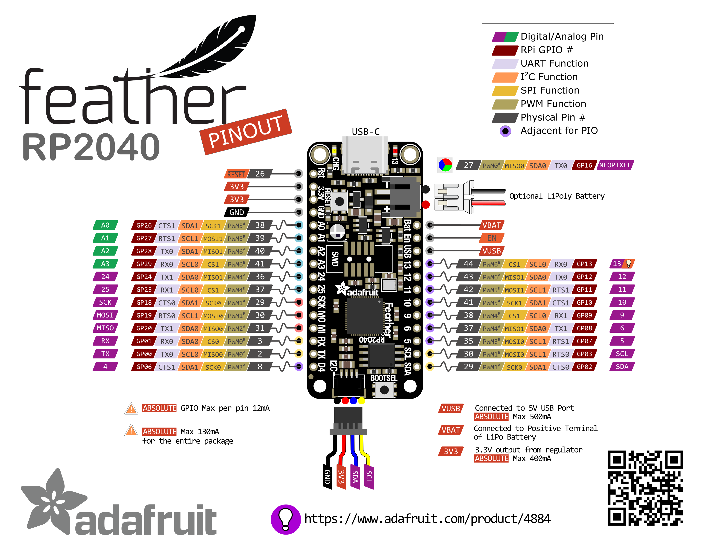

# FeatherRP2040-discovery

## Adafruit Feather RP2040

- <https://learn.adafruit.com/adafruit-feather-rp2040-pico>
- <https://circuitpython.org/board/adafruit_feather_rp2040/>

By default the Feather RP2040 use CircuitPython that is a simpler version of MicroPython but it include all drivers of Adafruit products. The delta between both can be find here :

- <https://core-electronics.com.au/tutorials/circuitpython-vs-micropython-differences.html

and

- <https://learn.adafruit.com/getting-started-with-raspberry-pi-pico-circuitpython/micropython-or-circuitpython

     TODO : FIND A WAY TO INSTALL MICRO PYTHON ON THE FEATHER RP2040.

### Adafruit Feather RP2040 Pin Out

